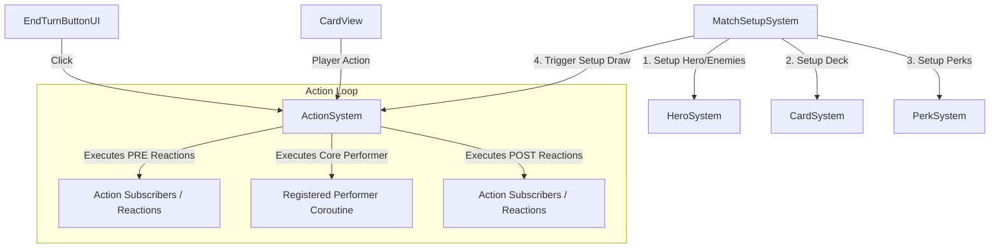

# slay the spire clone
Slay the Spire mechanics recreated in Unity from scratch by me
# Slay the Spire Clone: Code Documentation

This document provides a comprehensive overview of the architecture, design patterns, and code structure of the **Slay the Spire Clone** Unity project.

---

## 1. Architectural Overview

The project uses a highly decoupled, data-driven, and event-driven architecture based on a custom **Command-Performer (Action System)** pattern. 



### Key Architectural Pillars:
1. **Separation of Model, View, and System (MVS)**:
   - **Models**: Pure data classes (`Card`, `Perk`, `Effect`, `TargetMode`).
   - **Views**: MonoBehaviours managing visual rendering, tweens, and player inputs (`CardView`, `CombatantView`, `HandView`, `ArrowView`).
   - **Systems**: Singletons managing state, business logic, and action processing (`CardSystem`, `EnemySystem`, `ManaSystem`, `PerkSystem`, `ActionSystem`).
2. **Command / Action System**: Actions (subclasses of [GameAction](file:///d:/Unity%20Projects/Slay-the-Spire-Clone/Assets/_Project/Scripts/Systems/Action%20System/GameAction.cs)) represent game events. Systems register Coroutine-based "Performers" to execute the action's visual and mechanical logic, and can subscribe to "Reactions" that run before or after the action completes.
3. **Data-Driven Configuration**: ScriptableObjects ([CardData](file:///d:/Unity%20Projects/Slay-the-Spire-Clone/Assets/_Project/Scripts/Data/CardData.cs), [EnemyData](file:///d:/Unity%20Projects/Slay-the-Spire-Clone/Assets/_Project/Scripts/Data/EnemyData.cs), [HeroData](file:///d:/Unity%20Projects/Slay-the-Spire-Clone/Assets/_Project/Scripts/Data/HeroData.cs), [PerkData](file:///d:/Unity%20Projects/Slay-the-Spire-Clone/Assets/_Project/Scripts/Data/PerkData.cs)) define game elements, allowing designers to easily configure new cards, perks, and enemies in the Unity Editor without modifying code.

---

## 2. Core Systems & Action Pipeline

### Action System
The [ActionSystem](file:///d:/Unity%20Projects/Slay-the-Spire-Clone/Assets/_Project/Scripts/Systems/Action%20System/ActionSystem.cs) orchestrates the execution flow of all gameplay logic. It guarantees that actions are executed sequentially, resolving visual animations (via Coroutines) before moving to the next action or reaction.

* **AttachPerformer / DetachPerformer**: Registers a Coroutine (`Func<T, IEnumerator>`) to handle the execution of a specific action type.
* **SubscribeReaction / UnsubscribeReaction**: Subscribes a callback to execute during the `PRE` (before) or `POST` (after) phase of an action.
* **AddReaction**: Adds a nested reaction to the active phase.
* **Perform Flow**:
  1. **Pre-Reactions**: Triggers `preSubs` subscribers, then executes any reactions added during this phase.
  2. **Performer**: Executes the registered performer Coroutine, then executes any reactions added during execution.
  3. **Post-Reactions**: Triggers `postSubs` subscribers, then executes any reactions added during this phase.

### Interactions System
The [Interactions](file:///d:/Unity%20Projects/Slay-the-Spire-Clone/Assets/_Project/Scripts/Systems/Interactions.cs) system acts as an input gatekeeper.
* **PlayerCanInteract()**: Disallows interactions (dragging cards, clicking buttons) while `ActionSystem.Instance.IsPerforming` is true.
* **PlayerCanHover()**: Prevents card hover previews while a card is being dragged.

---

## 3. Card Mechanics & Hand Positioning

### Card Representation
* **[CardData](file:///d:/Unity%20Projects/Slay-the-Spire-Clone/Assets/_Project/Scripts/Data/CardData.cs) (ScriptableObject)**: Configures a card's name, description, sprite, mana cost, manual-target effect, and automatic-target effects.
* **[Card](file:///d:/Unity%20Projects/Slay-the-Spire-Clone/Assets/_Project/Scripts/Models/Card.cs) (C# Class)**: Instantiate-able instance of a card containing state and reference properties.

### Card System
The [CardSystem](file:///d:/Unity%20Projects/Slay-the-Spire-Clone/Assets/_Project/Scripts/Systems/CardSystem.cs) manages:
* **drawPile**, **discardPile**, and **hand** collections.
* **Action Performers**:
  * `DrawCardsGA`: Draws a set number of cards. If the draw pile is empty, it automatically triggers `RefillDeck()` using the discard pile.
  * `DiscardAllCardsGA`: Discards the player's entire hand (typically called at the end of the turn).
  * `PlayCardGA`: Plays a card, removing it from hand, sending it to the discard pile, spending mana, and queueing its manual and automatic effects.
* **Turn Reactions**:
  * Before the enemy's turn (`EnemyTurnGA` PRE): Triggers card discarding.
  * After the enemy's turn (`EnemyTurnGA` POST): Triggers drawing the starting hand.

### Spline-Based Hand View
The [HandView](file:///d:/Unity%20Projects/Slay-the-Spire-Clone/Assets/_Project/Scripts/Views/HandView.cs) positions card views along a Unity Spline using the [SplineContainer](file:///d:/Unity%20Projects/Slay-the-Spire-Clone/Assets/_Project/Scripts/Views/HandView.cs#L11).
* **Position Calculation**: Uses `Spline.EvaluatePosition` to position cards along the spline curve, centered around the midpoint `0.5`.
* **Rotation Calculation**: Calculates target rotation using the spline's tangent and up-vector:
  ```csharp
  Vector3 forward = spline.EvaluateTangent(p);
  Vector3 up = spline.EvaluateUpVector(p);
  Quaternion rotation = Quaternion.LookRotation(-up, Vector3.Cross(-up, forward).normalized);
  ```
* **Z-Fighting Prevention**: Stacks cards slightly along the z-axis using a `cardPositionOffset` multiplied by the card's hand index.
* **DOTween Animation**: Smoothly moves and rotates cards from their drawing/current positions to their designated spot on the spline.

---

## 4. Input & Targeting System

Cards fall into two targeting categories based on the existence of a `ManualTargetEffect`:

```mermaid
stateDiagram-v2
    [*] --> ClickCard
    ClickCard --> HasManualTarget?: Has Manual Target?
    
    state HasManualTarget? {
        --> Yes: Starts targeting line
        --> No: Drags card geometry
    }
    
    state Yes {
        DragMouse --> ReleaseMouseTarget: Release over target
        ReleaseMouseTarget --> PlayCardTarget: Plays card on enemy
        ReleaseMouseTarget --> CancelTarget: Returns to hand
    }
    
    state No {
        DragCard --> ReleaseMouseDrop: Release in drop zone
        ReleaseMouseDrop --> PlayCardAuto: Plays card automatically
        ReleaseMouseDrop --> ResetCardPos: Returns card to hand
    }
```

### Manual Targeting
* **[ManualTargetingSystem](file:///d:/Unity%20Projects/Slay-the-Spire-Clone/Assets/_Project/Scripts/Systems/ManualTargetingSystem.cs)**: Triggers the arrow view and performs a raycast over `targetLayerMask` upon release to find the target [EnemyView](file:///d:/Unity%20Projects/Slay-the-Spire-Clone/Assets/_Project/Scripts/Views/EnemyView.cs).
* **[ArrowView](file:///d:/Unity%20Projects/Slay-the-Spire-Clone/Assets/_Project/Scripts/Views/ArrowView.cs)**: Dynamically updates a `LineRenderer` to draw a curved targeting line and points the `arrowHead` GameObject towards the cursor.

### Drop Area Targeting
* **[CardView.CanPlayCard()](file:///d:/Unity%20Projects/Slay-the-Spire-Clone/Assets/_Project/Scripts/Views/CardView.cs#L101-L104)**: Casts a raycast forward. If it detects a collider on the `dropAreaLayer` and the player has enough mana, the card is played. Otherwise, the card interpolates back to its original position.

---

## 5. Combat, Effects, & Target Modes

### Combatants
* **[CombatantView](file:///d:/Unity%20Projects/Slay-the-Spire-Clone/Assets/_Project/Scripts/Views/CombatantView.cs)**: Base class for both the Hero and Enemies.
  * Tracks `MaxHealth` and `CurrentHealth`.
  * Triggers visual impact feedback using `transform.DOShakePosition` when damage is taken.
  * Updates HP UI.
* **[HeroView](file:///d:/Unity%20Projects/Slay-the-Spire-Clone/Assets/_Project/Scripts/Views/HeroView.cs)**: View wrapper representing the Hero.
* **[EnemyView](file:///d:/Unity%20Projects/Slay-the-Spire-Clone/Assets/_Project/Scripts/Views/EnemyView.cs)**: Exposes `AttackPower` and updates ATK text overlays.
* **[EnemyBoardView](file:///d:/Unity%20Projects/Slay-the-Spire-Clone/Assets/_Project/Scripts/Views/EnemyBoardView.cs)**: Places enemies on spawning slots and removes them with a scale-down animation upon death.

### Effects & Targeting
* **[Effect](file:///d:/Unity%20Projects/Slay-the-Spire-Clone/Assets/_Project/Scripts/Models/Effect.cs)**: Abstract class defining `GetGameAction(List<CombatantView> targets, CombatantView caster)`.
  * `DealDamageEffect`: Generates a `DealDamageGA` action targeting specific combatants.
  * `DrawCardsEffect`: Generates a `DrawCardsGA` action.
* **[TargetMode](file:///d:/Unity%20Projects/Slay-the-Spire-Clone/Assets/_Project/Scripts/Models/TargetMode.cs)**: Abstract class determining how automatic targets are selected.
  * `NoTM`: Returns no targets (used for self/no-target spells).
  * `AllEnemiesTM`: Returns all active enemies from the `EnemySystem`.
  * `RandomEnemyTM`: Selects a random enemy from the board.

---

## 6. Perk & Condition System

Perks act like Relics in *Slay the Spire*, triggering custom effects when specific conditions are met.

* **[PerkData](file:///d:/Unity%20Projects/Slay-the-Spire-Clone/Assets/_Project/Scripts/Data/PerkData.cs)**: Configures image assets, triggering conditions, and visual targeting properties.
* **[Perk](file:///d:/Unity%20Projects/Slay-the-Spire-Clone/Assets/_Project/Scripts/Models/Perk.cs)**:
  * Manages the lifecycle (`OnAdd`, `OnRemove`) of passive benefits.
  * Subscribes to the condition's trigger phase.
  * When triggered, resolves target parameters (such as targeting the caster of the triggering action if it implements `IHaveCaster`, or selecting auto-targets) and schedules the perk's effect as a reaction in the `ActionSystem`.
* **[PerkCondition](file:///d:/Unity%20Projects/Slay-the-Spire-Clone/Assets/_Project/Scripts/Models/PerkCondition.cs)**: Abstract validator mapping triggers to game events.
  * `OnEnemyAttackCondition`: Subscribes to `AttackHeroGA` events during the configured `ReactionTiming`.

---

## 7. Class Structure & Relationships

Here is the file structure mapping of the core code files located in `Assets/_Project/Scripts`:

```
_Project/Scripts/
│
├── Creators/
│   ├── CardViewCreator.cs                  # Spawns and initializes CardViews
│   └── EnemyViewCreator.cs                 # Spawns and initializes EnemyViews
│
├── Data/ (ScriptableObjects)
│   ├── CardData.cs                         # Configures cards
│   ├── EnemyData.cs                        # Configures enemies
│   ├── HeroData.cs                         # Configures hero starting stats/deck
│   └── PerkData.cs                         # Configures perks/relics
│
├── Effects/
│   ├── DealDamageEffect.cs                 # Generates DealDamageGA
│   └── DrawCardsEffect.cs                  # Generates DrawCardsGA
│
├── Extensions/
│   └── ListExtensions.cs                   # Helper methods for lists (e.g. shuffling)
│
├── Game Actions/
│   ├── AttackHeroGA.cs                     # Enemy attacks the hero
│   ├── DealDamageGA.cs                     # Applies damage to a combatant
│   ├── DiscardAllCardsGA.cs                # Moves all cards in hand to discard
│   ├── DrawCardsGA.cs                      # Draws specified number of cards
│   ├── EnemyTurnGA.cs                      # Triggers the enemy turn sequence
│   ├── KillEnemyGA.cs                      # Handles enemy death and removal
│   ├── PerformEffectGA.cs                  # Executes a card or perk effect
│   ├── PlayCardGA.cs                       # Plays a card from the hand
│   ├── RefillManaGA.cs                     # Refills hero's mana pool
│   └── SpendManaGA.cs                      # Deducts mana cost from player
│
├── General/
│   ├── Singleton.cs                        # Generic singleton pattern base class
│   └── Utils/
│       └── MouseUtils.cs                   # Helper for mouse/screen coordinate math
│
├── Interfaces/
│   └── IHaveCaster.cs                      # Interface for actions/effects that have a caster
│
├── Models/
│   ├── AutoTargetEffect.cs                 # Groups TargetMode and Effect
│   ├── Card.cs                             # Runtime card instancing model
│   ├── Effect.cs                           # Abstract command factory for visual effects
│   ├── Perk.cs                             # Relic-like trigger wrapper
│   ├── PerkCondition.cs                    # Abstract validator for Perk triggers
│   └── TargetMode.cs                       # Target resolver logic
│
├── Perk Condtions/
│   └── OnEnemyAttackCondition.cs           # Condition triggering on enemy attack
│
├── Systems/
│   ├── Action System/
│   │   ├── ActionSystem.cs                 # Main gameplay loop executor
│   │   ├── GameAction.cs                   # Abstract base gameplay event command
│   │   └── ReactionTiming.cs               # PRE and POST timing enum
│   ├── CardSystem.cs                       # Manages player's deck, hand, and play logic
│   ├── CardViewHoverSystem.cs              # Displays hovered card templates
│   ├── DamageSystem.cs                     # Listens to DealDamageGA, applies damage, triggers kills
│   ├── EffectSystem.cs                     # Resolves PerformEffectGA to active reactions
│   ├── EnemySystem.cs                      # Orchestrates enemy attacks and deaths
│   ├── HeroSystem.cs                       # Simple holder of HeroView reference
│   ├── Interactions.cs                     # Input gatekeeper, preventing actions when busy
│   ├── ManaSystem.cs                       # Tracks player mana, refilling it after enemy turns
│   ├── ManualTargetingSystem.cs            # Checks for targeted enemy raycasts
│   ├── MatchSetupSystem.cs                 # Initializes battle scene states
│   └── PerkSystem.cs                       # Manages active perks and their lifecycles
│
├── Target Modes/
│   ├── AllEnemiesTM.cs                     # Targets all active enemies
│   ├── NoTM.cs                             # Targets nothing / self
│   └── RandomEnemyTM.cs                    # Targets a random active enemy
│
├── UI/
│   ├── EndTurnButtonUI.cs                  # Triggers EnemyTurnGA
│   ├── ManaUI.cs                           # Displays player mana status
│   ├── PerksUI.cs                          # Relic bar horizontal grid layout
│   └── PerkUI.cs                           # Displays single relic sprite
│
└── Views/
    ├── ArrowView.cs                        # Draws targeting arrows
    ├── CardView.cs                         # Interactive card view component
    ├── CombatantView.cs                    # Handles health UI and shakes
    ├── EnemyBoardView.cs                   # Position-mapping grid for enemies
    ├── EnemyView.cs                        # Renders enemy stats and ATK intent
    ├── HandView.cs                         # Spline-based card visual alignment
    └── HeroView.cs                         # Renders hero visuals
```

---

## 8. Game Loop Lifecycle Tracing

### Phase 1: Battle Start
1. `MatchSetupSystem.Start()` triggers.
2. `HeroSystem.Instance.Setup(heroData)` configures the hero view.
3. `EnemySystem.Instance.Setup(enemyDataList)` spawns the combat enemies.
4. `CardSystem.Instance.Setup(heroData.Deck)` populates the draw pile with starting cards.
5. `PerkSystem.Instance.AddPerk(new Perk(perkData))` registers starting perks.
6. `MatchSetupSystem` calls `ActionSystem.Instance.Perform(new DrawCardsGA(5))` to draw the opening hand.

### Phase 2: Playing a Card
1. The user drags a card.
2. If the card requires a manual target:
   - `CardView.OnPointerDown` triggers `ManualTargetingSystem.Instance.StartTargeting`.
   - The user drags the arrow pointing to an enemy and releases.
   - `CardView.OnPointerUp` validates target & mana, executing `ActionSystem.Instance.Perform(new PlayCardGA(card, target))`.
3. If the card targets automatically:
   - The user drags the card above the drop area layer and releases.
   - `CardView.OnPointerUp` validates mana and drop placement, executing `ActionSystem.Instance.Perform(new PlayCardGA(card))`.
4. `PlayCardGA` performer:
   - Removes card from hand.
   - Moves the card to the discard pile via a DOTween scale/move animation.
   - Triggers `SpendManaGA` as a nested reaction to deduct mana.
   - Triggers target-effect actions (e.g. `PerformEffectGA` -> `DealDamageGA`).

### Phase 3: Ending Player Turn
1. The user clicks the **End Turn** button, triggering `ActionSystem.Instance.Perform(new EnemyTurnGA())`.
2. **Pre-Reactions Phase**:
   - `CardSystem` reacts to `EnemyTurnGA` (PRE) by queueing `DiscardAllCardsGA`.
   - The player's remaining hand is cleared and animated to the discard pile.
3. **Enemy Turn Execution**:
   - `EnemyTurnGA` performer iterates over all active enemies.
   - For each enemy, it queues an `AttackHeroGA`.
   - `AttackHeroGA` performer animates the enemy forward, triggers a shake on the hero view, and queues `DealDamageGA` on the hero.
4. **Post-Reactions Phase**:
   - `CardSystem` reacts to `EnemyTurnGA` (POST) by queueing `DrawCardsGA(5)`.
   - `ManaSystem` reacts to `EnemyTurnGA` (POST) by queueing `RefillManaGA` to restore mana to maximum.
   - Cards are drawn, mana is refilled, and the player's turn begins.
